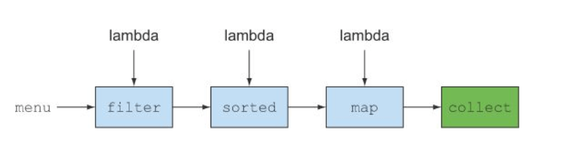
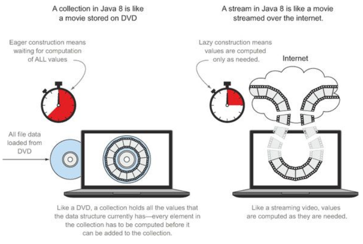
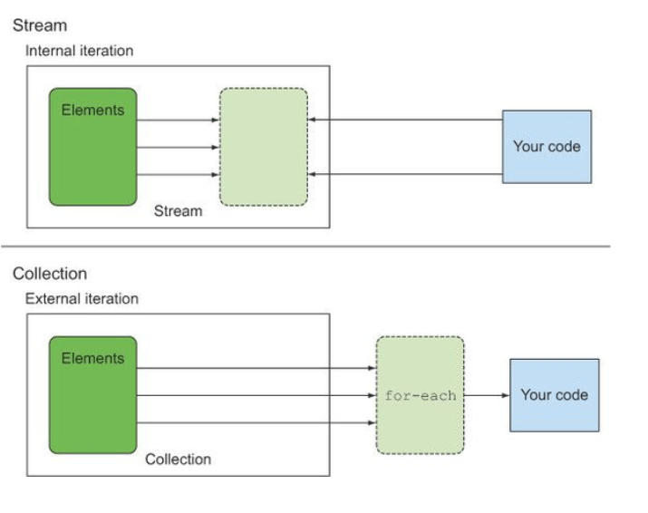

# Java Stream

## What are streams?

> Streams are an update to the Java API that lets you manipulate collections of data in a declarative way (you express a query rather than code an ad hoc implementation for it). For now you can think of them as fancy iterators over a collection of data. In addition, streams can be processed in parallel transparently, without you having to write any multi threaded code

```java
/* For example before java 8, we want to filter by weight and sort acs and get name*/
static void filterBefore8(List<Animal> list){
        List<Animal> result = new ArrayList<>();
        for (Animal animal: list){
            if (animal.getWeight() > 100) {
                result.add(animal);
            }
        }

        result.sort(new Comparator<Animal>() {
            @Override
            public int compare(Animal o1, Animal o2) {
                return Integer.compare(o1.getWeight(), o2.getWeight());
            }
        });

        List<String> resultName = new ArrayList<>();
        for(Animal animal : result){
            resultName.add(animal.getName());
        }
        System.out.println(resultName.toString());
    }

/* Such code in java 8 stream can be conside as */
    static void filterAfter8(List<Animal> animals){
        List<String> result = animals.stream()
                                    .filter(a -> a.getWeight() > 100)
                                    .sorted(Comparator.comparing(Animal::getWeight))
                                    .map(Animal::getName)
                                    .collect(Collectors.toList());
        System.out.println(result.toString());
    }
    
    
/* To exploit a multicore architecture and execute this code in parallel, you need only change
stream() to parallelStream() */
    static void filterAfter8(List<Animal> animals){
        List<String> result = animals.parallelStream()
                                    .filter(a -> a.getWeight() > 100)
                                    .sorted(Comparator.comparing(Animal::getWeight))
                                    .map(Animal::getName)
                                    .collect(Collectors.toList());
        System.out.println(result.toString());
    }

```



## Getting started with streams

> **Stream** is a sequence of element from a source (File, IO, network, or collection, ..) that support data processing operation.

- **Characteristic** of a stream:
    1. Sequence of data
    2. Source
    3. Data processing operation
    4. Pipe line
    5. Internal iterator.


## Stream vs collections:
- One big different between stream and collections is when they are computed, collection is an in-memory data structure that hold values meanwhile a stream is an sequence of data coming from a source. Collection is eager computed while stream is computed on demand. 

- As an analogy, we can think of collection is a list of movie frame store in DVD, any frame is store upfront and user can select any frame, meanwhile a stream is a sort of video loading from internet, only a few frame is load (and a few more is buffer) at particular time.



- Stream also have some characteristic such as:
    1. transversal only one.
    ```java
    Stream<Animal> stream = animals.stream();
        stream.forEach(System.out::println);
        stream.forEach(System.out::println);
        
        
    Exception in thread "main" java.lang.IllegalStateException: stream has already been operated upon or closed
	at java.base/java.util.stream.AbstractPipeline.sourceStageSpliterator(AbstractPipeline.java:279)
	at java.base/java.util.stream.ReferencePipeline$Head.forEach(ReferencePipeline.java:658)
	at stream.Intro.main(Intro.java:60)
    ```
    
    2. External vs internal iteration
    

    
## Stream operation:
- Working with stream operation require three steps:
1. Data source
2. Intermediate operation (such as map, filter, distinct, sorted, limit ,... )
3. Terminate operation (such as count, collect, forEach ,...)

```java
long count = menu.stream()
                .filter(d -> d.getCalories() > 300)
                .distinct() // intermeidate operation
                .limit(3)   // intermediate operation
                .count();   // terminate operation 
```

## Working with stream
### Filter and slicing
```java
List<Animal> list = animals.stream()
                                    .filter(p -> p.getWeight() >= 800)
                                    .distinct()
                                    .skip(1)
                                    .limit(3)
                                    .collect(Collectors.toList());
```

### Mapping:
```java
        List<String> arrayString = new ArrayList<>(Arrays.asList("TCB", "ACB"));
        List<String> result = arrayString.stream()
                                       .map(p -> p.split(""))
                                       .flatMap(Arrays::stream)
                                       .collect(Collectors.toList());
        
        
        // 1, 2, 3, 5 --> 1, 4, 9, 25                               
        List<Integer> arrayInt = new ArrayList<>(Arrays.asList(1, 2, 3, 5));
        List<Integer> resultInt = arrayInt.stream()
                                        .map(p -> p*p)
                                        .collect(Collectors.toList());
        System.out.println(resultInt.toString());

        // 1, 2, 3, 5 & 4, 5, 6 --> [[1, 4], [1, 5], [1, 6], [2, 4], [2, 5], [2, 6], [3, 4], [3, 5], [3, 6]]
        List<Integer> firstNum = new ArrayList<>(Arrays.asList(1, 2, 3));
        List<Integer> secNum = new ArrayList<>(Arrays.asList(4, 5, 6));
        List<ArrayList<Integer>> mergeNum = firstNum.stream()
                                            .flatMap(i -> secNum.stream()
                                                                .map(j -> new ArrayList<>(Arrays.asList(i,j))))
                                            .collect(Collectors.toList());
        System.out.println(mergeNum.toString());

        // 1, 2, 3, 5 & 4, 5, 6 --> [[1, 5], [2, 4], [2, 6], [3, 5]]
        mergeNum = firstNum.stream()
                            .flatMap(i -> secNum.stream()
                                                .filter(j -> ((i + j) % 2) == 0)
                                                .map(j -> new ArrayList<>(Arrays.asList(i,j))))
                            .collect(Collectors.toList());
        System.out.println(mergeNum.toString());
```

### Finding and matching: 
```java
        if(animals.stream().anyMatch(p -> p.getWeight() == 900)) {
            System.out.println("There is animal weight 900");
        }

        if (animals.stream().allMatch(p -> p.getWeight() > 0)){
            System.out.println("All animal weight is positive");
        }
```

### Reducing
```java
List<Integer> list = new ArrayList<>(Arrays.asList(1, 2, 3, 4, 5, 6));
int sum = list.stream().reduce(0, Integer::sum);
int mul = list.stream().reduce(1, (a, b) -> a*b);
int total = list.stream().map(p -> 1).reduce(Integer::sum).orElse(-1);
```

### Stream operations: stateless vs. stateful.
- Stateful Stream: reduce, min, max, ...
- Stateless Stream: map, filter, ... 

```java
public static void main(String[] args) throws InterruptedException {
        // Find all transactions in the year 2021 and sort them by value (small to high).
        list.stream()
            .filter(t -> t.dealTime.getYear() == 2021)
            .sorted(Comparator.comparing(Transaction::getAmount))
            .forEach(System.out::println);

        // What are all the unique cities where the traders work?
        list.stream()
            .map(Transaction::getOriginLocation)
            .distinct()
            .forEach(System.out::println);

        // Find all traders from NY and sort them by name.
        list.stream()
            .filter(t -> t.originLocation.equals("NY"))
            .sorted(Comparator.comparing(Transaction::getTraderName))
            .forEach(System.out::println);

        // Return a string of all traders’ names sorted alphabetically.
        list.stream()
            .map(Transaction::getTraderName)
            .sorted((String::compareTo))
            .forEach(System.out::println);

        // Are any traders based in Milan?
        if (list.stream().anyMatch(p -> p.getOriginLocation().equals("MI"))){
            System.out.println("There is trader in Milan");
        } else {
            System.out.println("No");
        }

        // What’s the highest value of all the transactions?
        Integer result = list.stream()
                            .map(Transaction::getAmount)
                            .reduce(Integer::max)
                            .orElse(-1);
        System.out.println(result);

        // Find the transaction with the smallest value
        Transaction transaction = list.stream()
                                      .reduce(list.get(0), (t1, t2) -> {
                                          if (t1.getAmount() < t2.getAmount()){
                                              return t1;
                                          }
                                          return t2;
                                      });
        System.out.println(transaction);

        Stream<List<Integer>> stream = IntStream.range(1, 100)
                                                .boxed()
                                                .flatMap(a -> IntStream.range(a, 100)
                                                .filter(b -> Math.sqrt(a*a + b*b) % 1 == 0)
                                                .mapToObj(b -> Arrays.asList(a, b, (int) Math.sqrt(a*a + b*b))));
        stream.limit(10).forEach(System.out::println);
    }

```

### Building streams:
```java
 // build stream from values
 Stream<String> stringStream = Stream.of("TCB", "ACB", "HDB");
 stringStream.map(String::toLowerCase).forEach(System.out::println);

 // build stream from array
 int[] arr = new int[]{1, 2, 3};
 IntStream integerStream = Arrays.stream(arr);
 integerStream.forEach(System.out::println);

 // build stream from file
 try(Stream<String> lines = Files.lines(Paths.get("data.txt"), Charset.defaultCharset())){
     lines.forEach(System.out::println);
 } catch (IOException exception){
     exception.printStackTrace();
 }
```

### Collecting data with streams